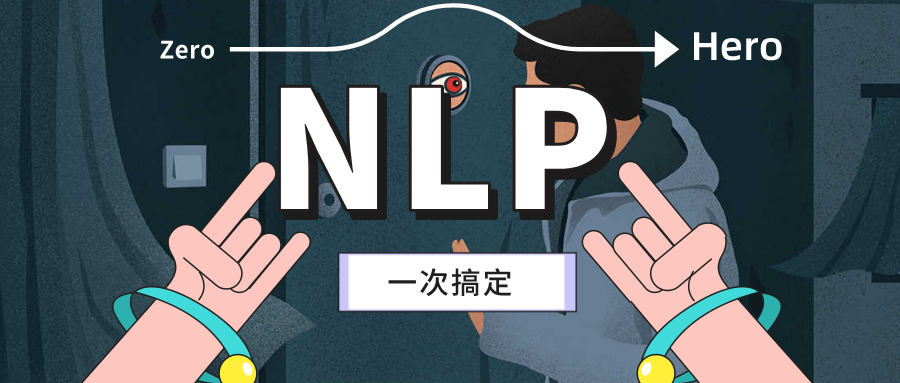

# nlp-zerotohero

<p align="center"></p>

`nlp-zerotohero` 是一个学习 NLP 的教程，区别于其他的一些 tutorial，这个教程希望不仅仅能够带你入门 NLP， 同时也希望能够帮助你跟我一起进阶。考虑到目前工业界使用 `tensorflow` 较多，所以本教程使用 `tensorflow` 作为深度学习的框架。同时，为了让不同操作系统的人都能有比较一致的学习体验，所以我们使用 `docker` 作为环境部署的工具，屏蔽掉不同操作系统带来的复杂的部署问题。使用我们提供的 `docker` 镜像后，你将获得一个可供实验的 `jupyterlab` 平台，在学习平台里你可以获得交互式学习的体验。祝你早日成为能够独当一面的 NLP 英雄！


## 快速开始

[访问网站浏览](http://nlp-zerotohero.bslience.cn/intro.html)

## 交互式学习

1. 配置自然语言处理交互式开发环境

-  GPU 版本
```bash
docker run -d \
    -p 8080:8080 \
    --name "ml-workspace" \
    -v "<nlp-zerotohero文件夹路径>:/workspace" \
    --env AUTHENTICATE_VIA_JUPYTER="<密码>" \
    --shm-size 512m \
    --restart always \
    --gpus all \
    mltooling/ml-workspace-gpu:0.13.2
```

-  无 GPU 版本
```bash
docker run -d \
    -p 8080:8080 \
    --name "ml-workspace" \
    -v "<nlp-zerotohero文件夹路径>:/workspace" \
    --env AUTHENTICATE_VIA_JUPYTER="<密码>" \
    --shm-size 512m \
    --restart always \
    --gpus all \
    mltooling/ml-workspace:0.13.2
```

2. 打开 <host>:8080，进入到交互式 notebook。
3. 按照字母和书籍顺序配合学习。


**如果觉得有帮助，希望能给我个星星⭐️**

<p align="center">
    
</p>

## Author

    - 张春阳 @春阳CYang
    - 知乎 @春阳CYang
    - 作者邮箱：zhangchunyang_pri@126.com

